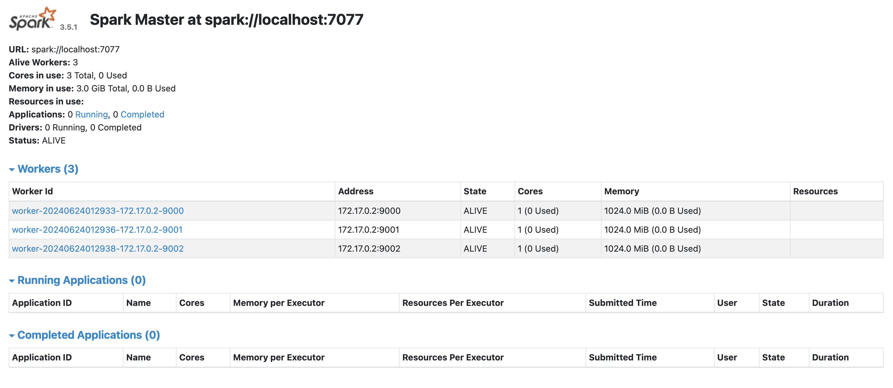

# Spark examples

[](https://spark.apache.org/)<br>

[](https://www.python.org/downloads/release/python-31012/)<br>

[](https://docs.astral.sh/ruff/) [](https://black.readthedocs.io/en/stable/) [](https://pycqa.github.io/isort/)<br>

[](https://conventionalcommits.org) [](https://pre-commit.com/)

This repo holds some examples, to start familiarizing yourself with [Spark](https://spark.apache.org/).

The idea is to quickly create a Spark cluster in your machine, and then run some jobs. In these examples, we're going to use the Sparks' Python API, named [PySpark](https://spark.apache.org/docs/latest/api/python/index.html).

## Directories structure

```text
.
├── .dockerignore
├── .gitignore
├── .markdownlint.json
├── .pre-commit-config.yaml
├── .python-version
├── .vscode
│   ├── extensions.json
│   └── settings.json
├── Dockerfile
├── LICENSE
├── Makefile
├── README.md
├── apps
│   ├── intro.py
│   └── python_app.py
├── conf
│   ├── spark-env.sh
│   └── workers
├── mypy.ini
├── noxfile.py
├── poetry.lock
└── pyproject.toml

4 directories, 19 files
```

## Pre-requisites

You'll need the following tools in your machine:

- [Git](https://git-scm.com/)
- [Docker](https://www.docker.com/)
- [GNU make](https://www.gnu.org/software/make/)

Also, it's recommended to have [pyenv](https://github.com/pyenv/pyenv) installed and working.

Please, keep in mind that a small Spark cluster like this one requires at least 2GB of RAM and 1 CPU core.

## Set up the environment

### 1. Build the Docker image

The first thing you'll need to do is build the required Docker image:

```shell
make build
```

The built image is tagged as `spark-local`.

### 2. Start the container

You can start the `spark-local` container with:

```shell
make run
```

### 3. Configure the Spark cluster

In the `conf/spark-env.sh` file you'll find some settings to configure the Spark cluster.

This example uses the following settings:

```shell
# conf/spark-env.sh

SPARK_EXECUTOR_CORES=1
SPARK_EXECUTOR_MEMORY=512M
SPARK_DRIVER_MEMORY=512M
SPARK_MASTER_HOST=localhost
SPARK_MASTER_PORT=7077
SPARK_MASTER_WEBUI_PORT=4040
SPARK_WORKER_CORES=1
SPARK_WORKER_MEMORY=1G
SPARK_WORKER_INSTANCES=3
SPARK_WORKER_PORT=9000
SPARK_WORKER_WEBUI_PORT=4041
SPARK_DAEMON_MEMORY=512M
```

All these settings are self-explanatory, but for example, you can modify the number of worker nodes by changing the `SPARK_WORKER_INSTANCES` variable.

### 4. Start the Spark cluster

You can start the Spark cluster with:

```shell
make spark-start
```

Wait a few seconds, and go to `localhost:4040` in your browser, you'll see a UI like this:



## Run Spark jobs
